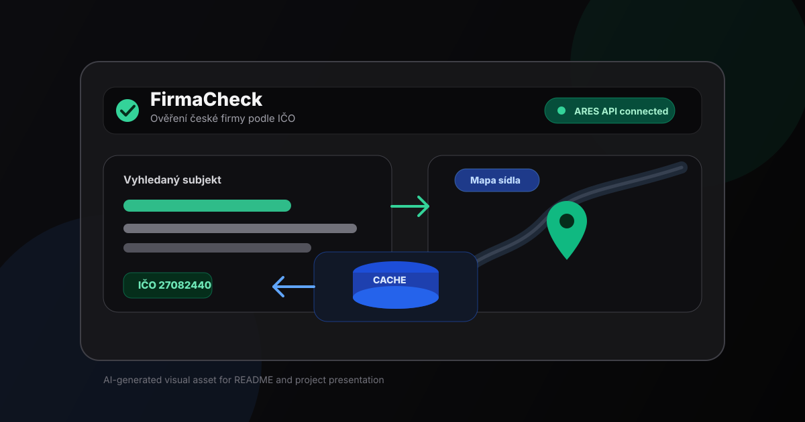

# FirmaCheck

Webová aplikace pro okamžité ověřování českých ekonomických subjektů podle IČO. Data jsou načítána z oficiálního státního registru ARES a inteligentně cachována v Turso edge databázi — opakované dotazy jsou vráceny okamžitě bez zbytečného volání externího API.




---

## Funkce

- **Vyhledávání podle IČO** — zadejte 8místné IČO a získejte název firmy, adresu sídla a polohu na mapě
- **Cache vrstva** — první dotaz načte data z ARES API a uloží je do Turso DB; každý další dotaz na stejné IČO je obsloužen lokálně (výrazně rychlejší odezva)
- **Vizuální indikátor zdroje** — výsledek jasně ukazuje, zda pochází z cache nebo přímo z ARES
- **Historie vyhledávání** — posledních 50 vyhledaných subjektů zobrazeno v pravém panelu; kliknutím znovu zobrazíte detail
- **CSV export** — celá historie jedním kliknutím exportovatelná do souboru (UTF-8 BOM pro správné zobrazení českých znaků v MS Excel)
- **Rate limiting** — ochrana API endpointů; stav uložen v Turso DB, funguje i v serverless prostředí
- **Rychlé tipy** — předvolené zkratky pro rychlé otestování (Alza.cz, Seznam.cz, Škoda Auto)
- **AI vizuální prvek** — vlastní SVG logo `public/ai-firmacheck-logo.svg` vygenerované AI asistentem a použité v hlavičce aplikace i jako favicon (`src/app/icon.svg`)

---

## Technologie

| Vrstva | Technologie |
|---|---|
| Framework | [Next.js 16](https://nextjs.org/) — App Router, Server Components, Route Handlers |
| UI | [React 19](https://react.dev/) — `'use client'` komponenty, hooks |
| Styling | [Tailwind CSS 4](https://tailwindcss.com/) — utility-first, vlastní `@theme` konfigurace |
| Databáze | [Turso](https://turso.tech/) — edge SQLite (libSQL), `@libsql/client` |
| Zdroj dat | [ARES API](https://ares.gov.cz/) — veřejné REST API Ministerstva financí ČR |
| Testy | [Vitest](https://vitest.dev/) — rychlé unit testy validační logiky |
| Fonty | [Geist](https://vercel.com/font) — Geist Sans + Geist Mono (next/font/google) |

---

## Architektura

```
src/
├── app/
│   ├── _components/
│   │   ├── SearchForm.js      # Formulář, validace, rychlé tipy, chybová hláška
│   │   ├── CompanyResult.js   # Detail firmy + Google Maps embed
│   │   └── HistoryList.js     # Seznam cached firem, skeleton loader, CSV export
│   ├── api/
│   │   ├── company/[ico]/
│   │   │   └── route.js       # Hlavní endpoint: cache check → ARES fetch → uložení
│   │   └── companies/
│   │       └── route.js       # GET /api/companies — seznam posledních vyhledání
│   ├── layout.js
│   ├── page.js                # Orchestrátor stavu, hlavní stránka
│   └── globals.css
├── lib/
│   ├── turso.js               # Turso klient (singleton)
│   └── rate-limit.js          # Rate limiting přes Turso DB
db/
└── schema.sql                 # Definice tabulek companies + rate_limits
scripts/
└── init-db.js                 # Inicializační skript pro vytvoření DB tabulek
```

### Logika cache

```
GET /api/company/:ico
  ↓
Rate limit check (Turso DB)
  ↓
SELECT FROM companies WHERE ico = ? AND created_at > NOW() - 30 dní
  ├─ HIT  → vrátí data okamžitě (source: "cache")
  └─ MISS → fetch z ARES API
               ↓
             UPSERT INTO companies
               ↓
             vrátí čerstvá data (source: "ares")
```

---

## Spuštění lokálně

### 1. Požadavky

- Node.js 20+
- Účet na [turso.tech](https://turso.tech) (nebo lokální SQLite soubor)

### 2. Instalace závislostí

```bash
npm install
```

### 3. Konfigurace prostředí

Zkopírujte `.env.example` do `.env.local` a vyplňte hodnoty:

```bash
cp .env.example .env.local
```

```env
# Vzdálená Turso databáze:
TURSO_CONNECTION_URL=libsql://your-database.turso.io
TURSO_AUTH_TOKEN=your-auth-token

# Nebo lokální SQLite soubor (pro vývoj bez Turso účtu):
TURSO_CONNECTION_URL=file:./local.db
TURSO_AUTH_TOKEN=
```

### 4. Inicializace databáze

```bash
npm run db:init
```

Skript vytvoří tabulky `companies` a `rate_limits` podle `db/schema.sql`.

### 5. Spuštění vývojového serveru

```bash
npm run dev
```

Aplikace bude dostupná na [http://localhost:3000](http://localhost:3000).

---

## Produkční build

```bash
npm run build
npm run start
```

---

## Testy

Projekt používá Vitest pro malé unit testy aplikační logiky.

```bash
npm run test:run
```

Spustí testy jednorázově, vhodné pro kontrolu před odevzdáním nebo CI.

```bash
npm run test
```

Spustí testy ve watch režimu při vývoji.

Aktuálně testy pokrývají validaci IČO v `src/lib/validation.js`, kterou používá frontend i API endpoint `/api/company/:ico`.

---

## API endpointy

### `GET /api/company/:ico`

Vyhledá firmu podle IČO. Nejprve zkontroluje cache, při MISS zavolá ARES API.

**Parametry:** `ico` — 8místné IČO v URL cestě

**Odpověď (200):**
```json
{
  "ico": "27082440",
  "name": "ALZA.CZ a.s.",
  "address": "Jankovcova 1522/53, Holešovice, 170 00 Praha 7",
  "created_at": "2025-05-27T10:00:00.000Z",
  "source": "cache"
}
```

**Hlavičky:** `X-Cache: HIT | MISS`

**Rate limit:** 100 požadavků / 60 sekund (per IP)

---

### `GET /api/companies?limit=50`

Vrátí seznam posledně vyhledaných firem seřazených od nejnovějšího.

**Rate limit:** 60 požadavků / 60 sekund (per IP)

---

## Proměnné prostředí

| Proměnná | Povinná | Popis |
|---|---|---|
| `TURSO_CONNECTION_URL` | Ano | URL Turso databáze (`libsql://...` nebo `file:./local.db`) |
| `TURSO_AUTH_TOKEN` | Pro vzdálenou DB | Autentizační token Turso |
| `CACHE_TTL_MS` | Ne | TTL cache v milisekundách (výchozí: 2 592 000 000 = 30 dní) |

---

## Zdroj dat

Aplikace využívá veřejné [REST API ARES](https://ares.gov.cz/ekonomicke-subjekty-v-be/rest/ekonomicke-subjekty/) (Administrativní registr ekonomických subjektů) provozované Ministerstvem financí České republiky. Data jsou veřejně přístupná bez nutnosti registrace nebo API klíče.

---

## Nástroje použité při vývoji

Projekt byl vytvořen s pomocí AI nástrojů:

- [Claude Code](https://claude.ai/code) — Anthropic CLI pro AI-asistované programování přímo v terminálu
- [OpenAI Codex](https://openai.com/codex) — AI model pro generování a doplňování kódu
- [Antigravity](https://antigravity.dev) — AI vývojový asistent

---

## AI-asistovaný vývoj — použité prompty

Ukázka promptů, které byly použity při vývoji tohoto projektu s nástroji Claude Code, Codex a Antigravity:

**AI vizuální prvek**
> *„Vygeneruj malé SVG logo pro webovou aplikaci FirmaCheck, které spojí motiv ověření firmy, databázové cache a mapového pinu. Logo použij v hlavičce aplikace a zmiň ho v README.“*

**Analýza a code review**
> *„Analyzuj celý projekt, projdi všechny soubory a navrhni konkrétní vylepšení — zaměř se na architekturu, bezpečnost, výkon a kvalitu kódu."*

**Refaktoring architektury**
> *„Rozděl monolitický page.js na samostatné React komponenty. Každá komponenta by měla mít jasnou zodpovědnost, přijímat props a být znovupoužitelná."*

**Bezpečnost**
> *„Přidej do projektu bezpečnostní HTTP hlavičky — Content Security Policy, X-Frame-Options a další OWASP doporučení. Nakonfiguruj CSP tak, aby fungoval Google Maps iframe."*

**Rate limiting**
> *„Přepiš in-memory rate limiter na perzistentní řešení přes Turso DB, aby fungoval správně v serverless prostředí kde každý request může dostat novou instanci. Implementuj atomický UPSERT s RETURNING clause."*

**Funkce náhodných doporučení**
> *„Navrhni algoritmus, který bude uživatelům náhodně doporučovat velké české firmy jako rychlé tipy. Vytvoř pool firem z různých odvětví — technologie, bankovnictví, retail, logistika, média — a při každém načtení stránky vyber tři náhodné pomocí Fisher-Yates shuffle."*

**Oprava hydration chyby**
> *„Aplikace hází React hydration mismatch chybu kvůli Math.random() v useState initializeru. Navrhni fix, který zachová náhodnost na klientu a zároveň zajistí shodu server/klient renderu."*

**Dokumentace**
> *„Napiš profesionální README.md pro tento projekt. Zahrň přehled funkcí, tabulku technologií, diagram architektury s logikou cache, návod na lokální spuštění a dokumentaci všech API endpointů."*

**Offsetové stránkování historie**
> *„Uprav historii vyhledávání na stránkovanou s offsetovým dočítáním z databáze a přidej tlačítko 'Načíst další subjekty' na frontendu se zachováním plné zpětné kompatibility API.“*

**Klientské reaktivní vyhledávání**
> *„Přidej do panelu historie vyhledávací pole pro okamžité filtrování dříve vyhledaných subjektů podle názvu nebo IČO přímo na klientovi bez dalších síťových dotazů.“*

**Kopírování do schránky s vizuální odezvou**
> *„Implementuj u detailu firmy tlačítka pro rychlé kopírování IČO a Adresy do schránky s plynulou animací zeleného statusového odznaku 'Zkopírováno!'.“*

**Externí GPS a mapová navigace**
> *„Doplň pod interaktivní mapové okno rychlé odkazy pro spuštění navigace v plnohodnotné aplikaci Google Mapy a lokální službě Mapy.cz.“*
